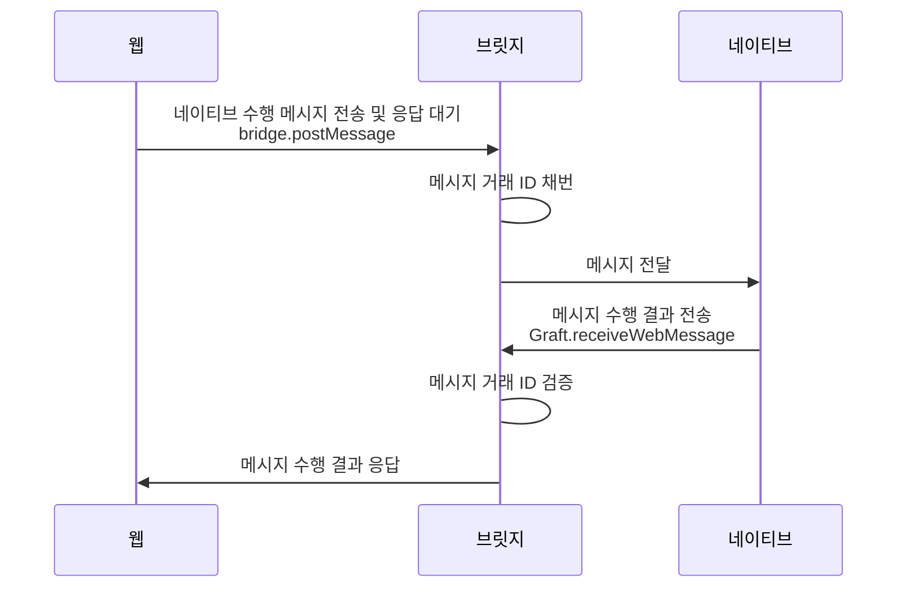
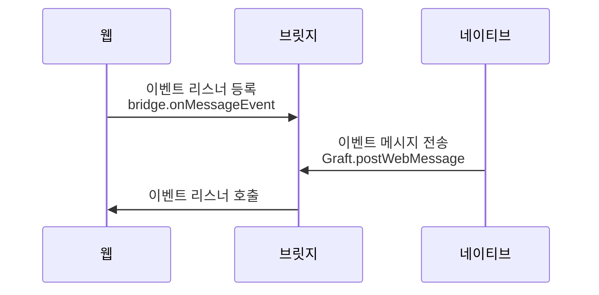

# Bridge 연결
하이브리드 웹 어플리케이션의 네이티브와 연동하여 메시지를 주고 받을 수 있는 브릿지 역할을 수행 합니다.

## 호출 인터페이스
네이티브에서 목적에 따라 호출 하는 인터페이스를 제공합니다.

> 네이티브 수행 응답 수신

[bridge](#graft-api-bridge)객체의 `postMessage()`메소드를 이용하여
네이티브에 기능 수행을 요청 하며, 네이티브는 전달 받은 메시지에 대한 기능을 수행 합니다.
이때 수행에 대한 결과를 자바스크립트에 전달 할 때 사용합니다.
```ts
Graft.receiveWebMessage(msg :GraftBridgeReceive) :void;

type GraftBridgePayload ={
    /** 수행 명령어 */
    command :string;
    /** 전달 데이터 */
    payload :{[string] :any};
};
```
> 네이티브 이벤트 수신
```ts
// 네이티브에서 발생된 이벤트를 웹에 전달 할때 사용합니다.
Graft.postWebMessage(msg :GraftBridgePayload) :void;

type GraftBridgeReceive ={
    /** 발생 이벤트 */
    command :string;
    /** 전달 데이터 */
    receive :{[string] :any};
};
```

## 서비스 흐름도

### 네이티브 메시지 전달
웹에서 네이티브 기능 수행을 요청 할 경우 사용합니다.<br>
브릿지를 이용하여 네이티브 기능 요청 메시지를 전달 하며 Promise를 반환 받습니다.<br>
네이티브 수행 결과에 대한 응답을 Promise를 통해 전달 받습니다.<br>



자바스크립트 구현 샘플
```js
// 키패드 오픈 요청
graft.bridge.postMessage({
    command: 'open_keypad',
    payload: {
        title :'키패드',
    },
})
.then(result =>{
    graft.log.out('키패드 입력 결과', result);
});
```

### 네이티브 이벤트 수신
네이티브에서 발생한 이벤트를 웹에 전달 할 경우 사용합니다.<br>
웹에서 브릿지를 이용하여 이벤트 리스너를 등록 합니다.<br>
네이티브에서 이벤트 발생 메시지를 브릿지를 통해 전달 되며, 등록된 리스너를 호출 해줍니다.<br>



자바스크립트 구현 샘플
```js
// 네이티브 이벤트 수신 리스너 등록
app.bridge.onMessageEvent =message =>{
    const {command, payload} =message;
    app.log.out('네이티브 이벤트 수신', message);
};
```

## 메시지 구조
메시지 요청 전문과 요청 결과에 대한 응답 전문이 존재 합니다.

### 메시지 요청 전문
메시지를 전송하는 주체로 웹에서 작성하는 전문입니다.<br>
웹에서 네이티브 기능 수행을 요청 할경우 사용 합니다.

```ts
type SendMessage ={
    // 메시지 거래번호로 웹에서 채번 합니다.
    txid?: string;
    // 메시지를 수신 받은 대상(네이티브)이 수행 할 명령어 입니다.
    command: string;
    // 기능 요청에 대한 전달 파라미터 입니다.
    payload: object;
}
```

### 메시지 응답 전문
메시지 수행 결과에 대한 응답 전문으로 네이티브에서 작성 합니다.<br>
웹에서 요청한 메시지에 대한 수행 결과를 전송 하는 경우 사용합니다.

```ts
type ReceiveMessage ={
    // 수신 받은 메시지를 그대로 사용합니다.
    txid: string;
    // 수행 결과에 대한 전달 파라미터 입니다.
    receive: object;
}
```

호출 스크립트 함수
```js
Graft.receiveWebMessage(ReceiveMessage);
```

### 이벤트 전달 전문
이벤트 발송 주체가 전달 하는 메시지로 네이트브에서 작성하는 전문입니다.<br>
네이티브에서 발생 하는 이벤트를 웹에 전달 할 경우 사용합니다.

```ts
type EventMessage ={
    // 이벤트 종류
    command: string;
    // 이벤트에 대한 전달 파라미터 입니다.
    payload: object;
}
```

호출 스크립트 함수
```js
Graft.postWebMessage(EventMessage);
```


## 네이티브 샘플

### 안드로이드

```kotlin
// 메시지 수신을 위한 구조체
data class GraftMessage(
    val txid: String,
    val command: String,
    val payload: Map<*, *>,
)
// 메시지 응답을 위한 구조체
data class GraftReceive(
    val txid: String,
    val receive: Map<*, *>,
)


class MainActivity : AppCompatActivity() {
    private lateinit var webView: WebView

    override fun onCreate(savedInstanceState: Bundle?) {
        webView = findViewById(R.id.web_view)
        webView.apply { ... }

        /**
        * ========== 브릿지 핸들러 설정 ==========
        * 자바스크립트 브릿지와 통신 할 인터페이스와 이름을 설정 합니다.
        * 여기에서는 "GraftNative"를 사용합니다.
        */
        webView.addJavascriptInterface(JavascriptBridge(this), "GraftNative")
        webView.loadUrl("http://localhost")
    }

    fun receiveBridgeMessage(message: String) {
        Log.i("bridge_message::receiveBridgeMessage", message)

        /**
        * ========== 수행 결과 전송 ==========
        * Graft.receiveWebMessage 함수를 호출 메시지 처리에 대한 응답을 전송 합니다.
        * 이 때 수신 메시지의 txid를 응답 전문에 포함 하여 전송 합니다.
        */
        Handler(Looper.getMainLooper()).postDelayed({
            webView.loadUrl("javascript:Graft.receiveWebMessage($message)")
        },100)
    }
}


class JavascriptBridge(private val mainActivity: MainActivity) {
    private val mapper = jacksonObjectMapper()

    // 자바스크립트와 통신 할 인터페이스 선언
    @JavascriptInterface
    fun postMessage(msg: String) {
        Log.i("postMessage", msg.toString())

        val message= mapper.readValue<GraftMessage>(msg)
        val receive= when(message.command) {
            "open_keypad"-> openKeypad(message)
            else-> commandNotfound(message)
        }

        mainActivity.receiveMessage(mapper.writeValueAsString(receive))
    }

    private fun openKeypad(message: GraftMessage): GraftReceive {
        val receive: Map<Any, Any> = mapOf("value" to "112233")
        return GraftReceive(txid =message.txid, receive =mapOf("value" to "112233"))
    }
    private fun commandNotfound(message: GraftMessage): GraftReceive {
        return GraftReceive(txid =message.txid, receive =mapOf(
            "error" to true,
            "value" to "존재하지 않는 커맨드 입니다."
        ))
    }
}
```

### IOS

```swift
// 메시지를 받기 위한 핸들러를 설정 합니다.
override func viewDidLoad() {
    let contentController = WKUserContentController()
    let configuration = WKWebViewConfiguration()

    /**
     * ========== 브릿지 핸들러 설정 ==========
     * 자바스크립트 브릿지와 통신 할 핸들러의 이름을 설정 합니다.
     */
    contentController.add(self, name: "GraftNative")

    configuration.userContentController = contentController
    webView = WKWebView(frame: .zero, configuration: configuration)
}


// 웹으로 부터 전달 된 메시지 요청에 대한 처리 구현 입니다.
extension ViewController: WKScriptMessageHandler {
    func userContentController(
        _ userContentController: WKUserContentController,
        didReceive message: WKScriptMessage
    ) {
        if message.name == "GraftNative" {
            print(message.body)

            let json = try? JSONSerialization.jsonObject(
                with: message.body, options: []
            ) as? [String : Any]
            let receiv = [
                "txid": json["txid"]
            ]

            if json["command"] == "open_keypad" {
                receive["receive"] = [
                    "value": "112233"
                ]
            }

            /**
            * ========== 수행 결과 전송 ==========
            * Graft.receiveWebMessage 함수를
            * 호출 메시지 처리에 대한 응답을 전송 합니다.
            * 이 때 수신 메시지의 txid를 응답 전문에 포함 하여 전송 합니다.
            */
            self.webView.evaluateJavaScript(
                "Graft.receiveWebMessage(\(receive))"
            ) { result, error in
                guard error == nil else {
                    print(error as Any)
                    return
                }
            }
        }
    }
}
```